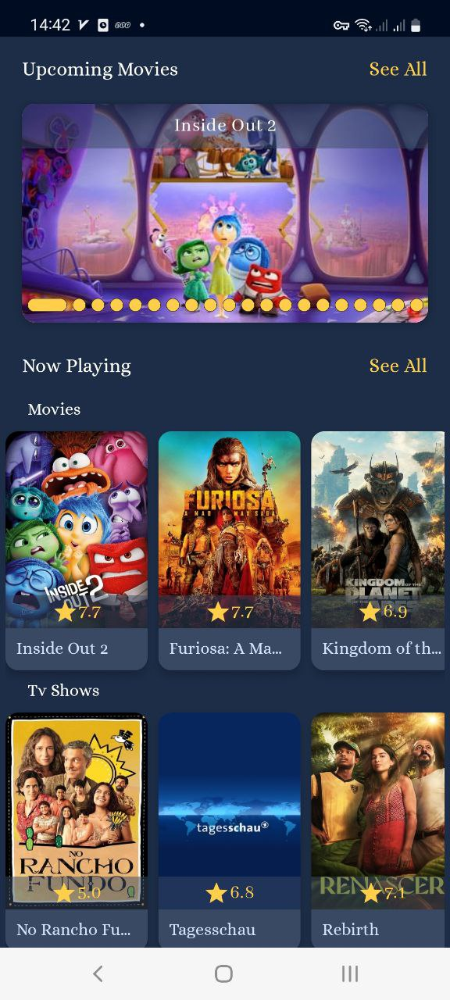
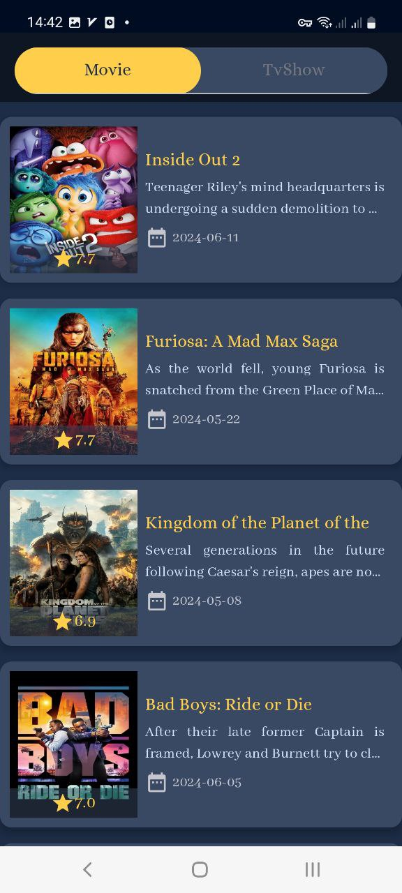

<h1 align="center"> Movie Pulse </h1>
<br>
<p align="center">
    
</p>
This Android application provides detailed information about movies and TV shows using the TMDb (The Movie Database) API. Users can explore top-rated, upcoming, and now-playing movies and TV shows. The app is built using Jetpack Compose for a modern, declarative UI and follows a multi-module architecture.
<br>
<br>


## Screenshots 

<p align="center">
  
    
    

<br>
    
  
  

</p>


## Demo
[](https://drive.google.com/file/d/1oNajtrwYE6KPmBhW_foDFrjCvaY8Z-d4/view?usp=drive_link)


[Show Demo Video](https://drive.google.com/file/d/1oNajtrwYE6KPmBhW_foDFrjCvaY8Z-d4/view?usp=drive_link)


## Features
* View top-rated, upcoming, and now-playing movies and TV shows
* View detailed information about movies and TV shows, including cast, crew, ratings, and synopsis

## Tech Stack

* Clean Architecture(MVVM)
* Single Activity
* Jetpack Navigation Component
* Retrofit - Network Requests
* Hilt - Dependency Injection
* [TMDB API](https://developer.themoviedb.org/)

## Getting Started
To get started with the WeatherApp, follow these steps:

1- Clone the repository:
```
   git clone https://github.com/AtefehTaheri/MoviePulse.git
```
2- Open the project in Android Studio.<br>
3- Get [TMDB Api Key](https://developer.themoviedb.org/) and add to local.properties with "API_KEY" tag
```
   API_KEY="<INSERT_YOUR_API_KEY>"
```
4- Build and run the application on your emulator or device.

[](https://github.com/AtefehTaheri/MoviePulse/releases)

or Get .APK : [Releases](https://github.com/AtefehTaheri/MoviePulse/releases)
